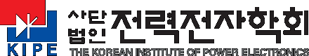

# RC_Driver

STM32G474 기반 PMSM 인버터 드라이버 펌웨어

## 📖 문서
[](https://rcdriver.netlify.app)

[👉 문서 바로가기](https://rcdriver.netlify.app)

## 프로젝트 개요
- MCU: STM32G474RET6
- 제어: FOC (Field Oriented Control)
- 센서: Hall 센서 + EEMF 센서리스
```
